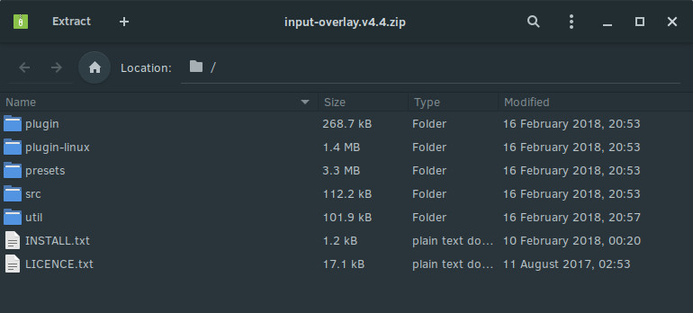
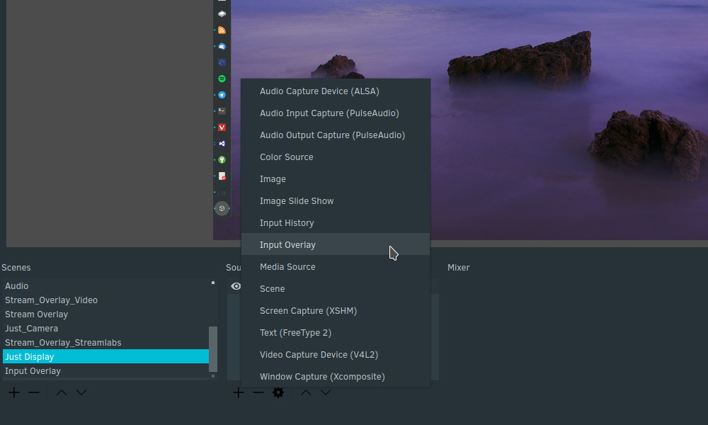
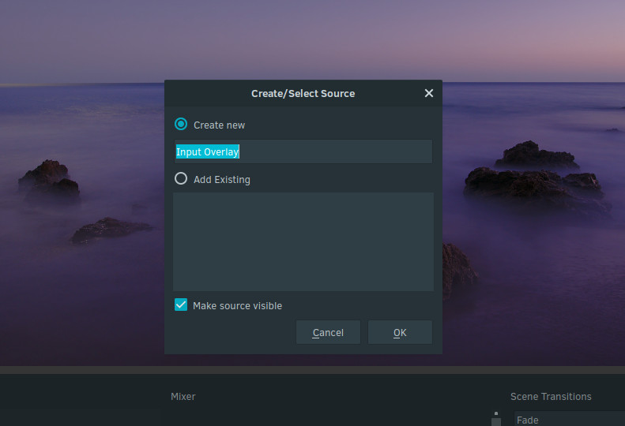
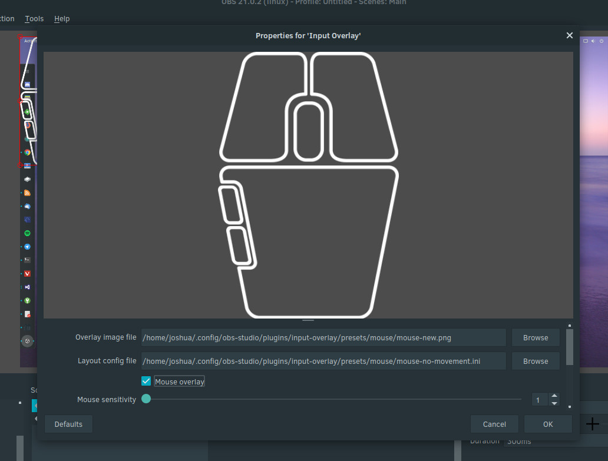

# Open Broadcaster Software (OBS)

This article covers the installation of OBS Studio as well as the use of third-party plugins.

## Installation

To install OBS Studio, either open up the Software Center and type `obs-studio` into the Search section or run the following command:

```bash
sudo eopkg install obs-studio
```

## Virtual Camera

OBS includes a virtual webcam device which can be used to send your OBS stream to video conferencing programs. In order to use this on Solus, you must first install from our repository a separate kernel module that is responsible for creating the necessary "loopback" device. There are two versions of this software available in the repository, you must choose the version that corresponds to the kernel you have installed.

To find out which kernel is installed, run:

```bash
uname -r
```

This should return a version which ends in `.current` or `.lts`.

- If you are running the "current" kernel, install `v4l2loopback-current`: `sudo eopkg install v4l2loopback-current`
- If you are running the "lts" kernel, install `v4l2loopback`: `sudo eopkg install v4l2loopback`

Once v4l2loopback is installed, reboot your computer. Next time you start OBS, it will prompt you for your password to set up v4l2loopback. After that, the virtual camera should be available as a webcam in other programs.

## Plugins

All OBS Studio plugins should be installed into their own respective folders inside the `~/.config/obs-studio/plugins` folder. If this folder does not exist for you, you'll need to create it before copying plugins into it.

When installing a plugin, the directory tree should look something like the following:

```
plugins
└── plugin-name
    ├── bin
    │   └── 64bit
    │       └── filename.so
    ├── data
    │   └── locale
    │       └── en-US.ini
```

In essence, you should have `bin/64bit` folders inside the plugin folder, with any shared object plugin files inside that. As OBS Studio for Solus only supports 64-bit, the plugin **must** support 64-bit as well.

Additionally, the plugin may come with additional files or folders, such as locale information. That locale information should be located in `data/locale`.

Most Linux-supporting plugins should provide pre-compiled tarballs or zip files that you can extract to get a pre-made / ready folder structure that you can simply copy / paste into `~/.config/obs-studio/plugins`

### Known Working Plugins

#### Input Overlay

The Input Overlay plugin enables you to show an input overlay of your gamepad, mouse, or keyboard. Pre-compiled release files are available on the Releases section of the [developer's website](https://github.com/univrsal/input-overlay).

To install Input Overlay, download the input-overlay-vNUM.zip file from their releases page, where NUM is the latest release number, such as 4.4.

Next, we'll install a library necessary to use the Input Overlay plugin, as well as an unzip tool to make the installation process easier. Run the following command:

```bash
sudo eopkg install libuiohook unzip
```

Next, click on the zip file in your File Manager to open up the Extract tool (such as File Roller). You will be presented with contents like the following.



Let's extract this to our Downloads folder to make the process of copying the contents we need more easily. Click the Extract button in the image indicated above. This will present you with a file dialog. Navigate to the Downloads folder and click Extract. This will create a folder, likely called something similar to `input-overlay.v4.4`.

Next let's run the following commands in the Terminal. The commands below will:

- Remove our zip file to make our directory renaming more reliable.
- Move our extracted input overlay in our Downloads directory to one which is without a version number, to make it easier for future commands.
- Extract all the preset zips and remove their zip files
- Create an `input-overlay` folder in `~/.config/obs-studio/plugins` as well as creating the `plugins` folder if needed.
- Copy over the necessary and recommended folders and files to our input-overlay plugin folder.

```bash
rm ~/Downloads/input-overlay*.zip
mv ~/Downloads/input-overlay.v* ~/Downloads/input-overlay
cd ~/Downloads/input-overlay/presets
for file in `ls *.zip`; do unzip "${file}" -d "${file:0:-4}"; done
rm *.zip
mkdir -p ~/.config/obs-studio/plugins/input-overlay
cp -R ~/Downloads/input-overlay/plugin-linux/* ~/.config/obs-studio/plugins/input-overlay/
cp -R ~/Downloads/input-overlay/presets ~/.config/obs-studio/plugins/input-overlay/
```

Now the Input Overlay source is available to us as a source (if you have OBS Studio already open, restart it), as shown in the below screenshot.



Upon clicking on this source, we'll be presented with the usual add / use existing source dialog.



After naming a source, such as "Mouse", click OK and you'll be presented with a dialog that looks similar to below. Do note that yours will be empty by default, as you've not yet selected an Overlay image file and Layout config file yet.



This is where the presets come in handy. Click the Browse button for Overlay image file and navigate to `.config/obs-studio/plugins/presets` and then the respective preset you want, such as mouse, and then the PNG within it. **You will need to enable hidden files** in the file dialog by using the keyboard combination `Ctrl+H` to see `.config`

Next, do the same for Layout config overlay, but instead go to the same folder as your PNG and select the `ini` file.

If you're using a mouse or gamepad, be sure to check the "Mouse overlay" or "Gamepad overlay" boxes respectively and tweak settings as you see fit.
